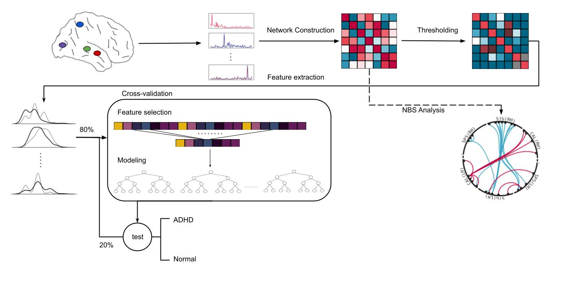

# Differential-Patterns-of-Associations-within-Audiovisual-Integration-Networks-in-Children-with-ADHD

This repository belongs to the article "Differential Patterns of Associations within Audiovisual Integration Networks in Children with ADHD"

**Abstract**:

Attention deficit hyperactivity disorder (ADHD) is a neurodevelopmental condition characterized by symptoms of inattention and impulsivity and has been linked to disruptions in functional brain connectivity and structural alterations in large-scale brain networks. While anomalies in sensory pathways have also been implicated in the pathogenesis of ADHD, exploration of sensory integration regions remains limited. In this study, we adopted an exploratory approach to investigate the connectivity profile of auditory-visual integration networks (AVIN) in children with ADHD and neurotypical controls, utilizing the ADHD-200 rs-fMRI dataset. In addition to network-based statistics (NBS) analysis, we expanded our exploration by extracting a diverse range of graph theoretical features. These features served as the foundation for our application of machine learning (ML) techniques, aiming to discern distinguishing patterns between the control group and children with ADHD. Given the significant class imbalance in the dataset, ensemble learning models like balanced random forest (BRF), XGBoost, and EasyEnsemble classifier (EEC) were employed, designed to cope with unbalanced class observations. Our findings revealed significant AVIN differences between ADHD individuals and neurotypical controls, enabling automated diagnosis with moderate accuracy. Notably, the XGBoost model demonstrated balanced sensitivity and specificity metrics, critical for diagnostic applications, providing valuable insights for potential clinical use. 

**Data**:
[ADHD-200](https://www.nitrc.org/frs/?group_id=383) (open-access dataset)

**Pipeline**

**Models**
1. [XGBoost](https://xgboost.readthedocs.io/en/stable/)
2. [Balanced Random forest](https://imbalanced-learn.org/stable/references/generated/imblearn.ensemble.BalancedRandomForestClassifier.html)
3. [EasyEnsemble](https://imbalanced-learn.org/stable/references/generated/imblearn.ensemble.BalancedRandomForestClassifier.html)
